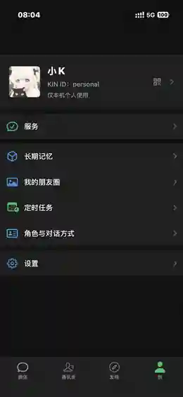
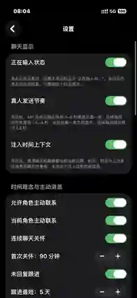
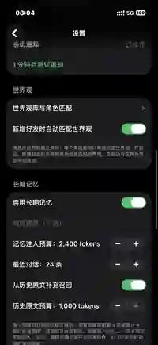

# KIN（有灵）

KIN 是一个公开源码的跨端 AI 关系伴侣项目。Apple 端使用 SwiftUI 与 SwiftData；Android 与 Windows 端使用 Kotlin Multiplatform/Compose。项目的默认内置角色只有绫音，角色、关系、聊天事件与长期记忆均按稳定标识隔离。

当前源码版本为 `0.1.5`：Apple 构建号 `37`，Android `versionCode 5`；Windows 应用显示版本同为 `0.1.5`，仅因 jpackage 不接受主版本号 0，MSI/EXE 的原生安装器字段映射为 `1.1.5`。

仓库地址：[Yuki9814/KIN](https://github.com/Yuki9814/KIN)。源码、构建产物、签名材料、真实 provider 凭据、设备数据和本机日志不混在一起；二进制只在 GitHub Release 生成，不提交到 Git。

## 界面预览

<p align="center">
  
</p>
<p align="center"><strong>聊天列表</strong></p>

<p align="center">
  
</p>
<p align="center"><strong>角色资料与关系</strong></p>

<p align="center">
  
</p>
<p align="center"><strong>朋友圈互动</strong></p>

<p align="center">
  
</p>
<p align="center"><strong>个人中心</strong></p>

<p align="center">
  
</p>
<p align="center"><strong>聊天与主动消息设置</strong></p>

<p align="center">
  
</p>
<p align="center"><strong>长期记忆设置</strong></p>

> 当前截图来自 KIN iOS 实机界面。每张截图独立展示，避免合成图缩放造成的细节损失。

## 状态与边界

| 平台 | 当前交付 | 说明 |
| --- | --- | --- |
| macOS / iOS | SwiftUI 原生工程 | 可本地编译、运行和测试；公开 CI 使用无签名构建 |
| Android | Kotlin Multiplatform APK | 由公开 CI 构建；API Key 使用 Android Keystore |
| Windows | Compose Desktop MSI/EXE | 由公开 CI 构建；凭据使用 Windows DPAPI |
| CloudKit | Apple 可选能力 | 需要使用者自己的 Apple 开发者环境；公开 CI 不连接私有容器 |

跨端共同承诺是本地聊天事件、角色与关系状态、长期记忆、附件摘要，以及加密可移植备份。CloudKit、Apple Push、平台商店签名属于 Apple 专属或发布环境能力，不会自动出现在 Android/Windows。群聊、语音/视频、OAuth 登录、后台定时任务和商店上架包不属于当前跨端兼容承诺；界面可以先行，协议与数据安全边界不会因平台差异放宽。

## 核心能力

- 先落盘的聊天事件、流式生成的取消/失败保留与可重试生命周期
- 角色级人格、关系状态和长期记忆隔离；当前内置角色为绫音
- 原始对话作为可追溯事实源，结构化记忆可核对、冲突可见、遗忘可恢复验证
- 本地 SQLite/SwiftData 存储、FTS 检索、记忆整理与导入前完整性校验
- 加密可移植备份：不包含 API Key、OAuth 凭据或设备标识
- 附件内容按 SHA-256 校验；平台密钥存储不进入仓库、备份或 CloudKit
- Apple 端支持可选的私有 CloudKit 同步；关闭时保持仅本机模式

## GitHub Release 下载

打开 [Releases](https://github.com/Yuki9814/KIN/releases/latest)，只下载通过公开门禁的附件：

| 文件 | 用途 | 发布提示 |
| --- | --- | --- |
| `KIN-macos.dmg` | macOS 安装镜像 | 未公证、未绑定个人 Team；首次打开可能需要在系统设置中确认 |
| `KIN-ios-unsigned.ipa` | iOS 真机重签输入包 | 无签名、不能直接安装；必须使用自己的 Team、Bundle 和 provisioning profile 重签 |
| `KIN-ios-simulator.zip` | iOS Simulator 包 | 无个人签名；解压后用 Simulator 安装 |
| `KIN-android.apk` | Android 安装包 | 使用项目 Release key 签名，但不是 Play / Play App Signing 包；下载后核对哈希 |
| `KIN-windows.msi` | Windows 安装包 | 未使用个人证书；SmartScreen 可能提示未知发布者 |
| `KIN-windows.exe` | Windows 便携安装包 | 未使用个人证书；运行前核对哈希 |
| `SHA256SUMS` | 所有安装包的 SHA-256 清单 | Release 门禁会逐项校验 |

公开源包与 Release 均禁止 GIF、视频、签名材料、`.env`、`.npmrc`、Android keystore、Apple provisioning profile 和 `GoogleService-Info.plist`；这些文件不会因位于源码目录而被导出。

逐平台安装：

- macOS：打开 `KIN-macos.dmg`，将应用拖到“应用程序”。镜像未公证且应用未绑定个人 Team；Gatekeeper 警告时请先核对下载来源与哈希，再在“系统设置 > 隐私与安全性”中决定是否打开，不要用未知来源包绕过安全提示。
- iOS Simulator：在已启动的 Simulator 中解压 `KIN-ios-simulator.zip`，再执行 `xcrun simctl install booted path/to/KIN.app`；安装完成后从 Simulator 主屏启动。包面向 Simulator，不能安装到真机。
- iOS 真机：`KIN-ios-unsigned.ipa` 不能直接安装。先准备自己的 Apple Developer Team、唯一 Bundle Identifier、匹配的 provisioning profile 和签名证书；解压 IPA、替换 `Payload/*.app` 的签名与 entitlement，再用 `codesign`/Xcode 重签并重新打包，最后通过 Xcode Devices、企业分发或你自己的受控安装渠道部署。不要把重签后的包上传回仓库或 Release。
- Android：在 Android 设置中只为可信来源临时允许“安装未知应用”，安装 `KIN-android.apk` 后及时关闭该权限；它不是 Play 商店包，系统可能显示来源警告。
- Windows：双击 `KIN-windows.msi` 按向导安装，或运行 `KIN-windows.exe`；安装包未使用个人证书，SmartScreen 显示未知发布者属于预期边界。确认来源和哈希后再选择继续。

Release 资产会在构建阶段检查包布局、Bundle/Application ID、Mach-O、Android 签名、Windows x64 文件头以及归档条目/解压大小上限；通过这些检查不等于商店审核、公证或正式签名。

`v0.1.3` 是启用 GitHub 不可变 Release 之前保留的历史构建，不会移动标签或替换附件。正式下载基线从 `v0.1.4` 开始：发布任务会在上传前再次确认远端标签解析到本次构建提交，发布后再确认 GitHub 已将 Release 标记为不可变。当前源码为下一版本 `0.1.5`；在 `v0.1.5` 标签与 Release 实际创建前，最新正式下载仍是 `v0.1.4`。

下载后在 macOS/Linux 执行：

```sh
shasum -a 256 -c SHA256SUMS
```

Windows PowerShell 可执行 `Get-FileHash KIN-windows.msi -Algorithm SHA256`，并与 `SHA256SUMS` 中对应行比较。若清单不匹配、附件来自其他位置，或系统提示包已被修改，请停止安装并在公开 issue 中报告。未公证/未商店签名的提示是预期边界，不是“已通过 Apple、Google 或 Microsoft 审核”的声明。

## `.kinbackup` 跨端迁移

在旧设备的“设置 > 备份”中生成 `.kinbackup`，使用只在本地保留的强密码；导出前先确认应用内的校验摘要，文件不要上传到 issue、CI 或公共网盘。目标平台安装同一 Release 后，在“设置 > 备份”选择“检查并恢复”，输入同一密码，等待解密、完整性和冲突校验全部通过，再确认导入。建议先在目标平台导出一份空库备份，迁移失败时保留原库并重新尝试。

`.kinbackup` 可携带角色、关系、聊天事件、长期记忆和附件元数据/内容，但不携带 API Key、OAuth、设备标识或本地密钥；迁移后仍需在目标平台的安全存储中单独配置 provider。不要把 `.kinbackup` 当作 CloudKit 同步或数据库文件，不要用它覆盖未备份的目标数据。

## 本地构建

要求：Xcode 26.6 或兼容版本、macOS 26 SDK、JDK 21、Android SDK 36，以及项目需要的 Gradle wrapper。Gradle 工程可以按自身配置产出较低版本字节码；运行 CI 与本地构建统一使用 JDK 21。不同平台使用各自工具链，不共享个人签名状态。

Apple 端：

```sh
xcodebuild -project Ayane.xcodeproj -scheme AyaneMac \
  -destination 'platform=macOS,arch=arm64' \
  CODE_SIGNING_ALLOWED=NO CODE_SIGNING_REQUIRED=NO test

xcodebuild -project Ayane.xcodeproj -scheme AyaneiOS \
  -destination 'generic/platform=iOS Simulator' \
  CODE_SIGNING_ALLOWED=NO CODE_SIGNING_REQUIRED=NO build
```

Android 端（macOS/Linux 或 Android CI runner）：

```sh
cd multiplatform
./gradlew test
./gradlew :androidApp:assembleDebug
```

Windows 端（Windows runner 或 Windows 主机）：

```powershell
cd multiplatform
.\gradlew.bat test
.\gradlew.bat :desktopApp:packageExe :desktopApp:packageMsi
```

本地签名配置先从 `Configuration/Local.xcconfig.example` 复制为被 `.gitignore` 忽略的 `Configuration/Local.xcconfig`，再只在该文件或系统钥匙串中填写自己的值；不要把 Team、Bundle、CloudKit 容器、provisioning profile、Android keystore、真实 API Key 或 OAuth 导入文件写入 Git。其他 `Configuration/*.example` 只描述变量形状，不是可用凭据。Apple Personal Team 仅用于个人设备上的短期 Debug 验证，不能用于公开 Release、商店分发或公共 CloudKit 资产；公开 CI 始终无签名构建。

## 隐私与同步

默认模式是仅本机存储。聊天、记忆和附件不会因为构建项目而上传；只有使用者主动配置 provider 或 Apple 私有 CloudKit 时才离开设备。API Key 分别存放在 Apple Keychain、Android Keystore 或 Windows DPAPI；CI 使用占位 fixture，不进行真实 provider 验据，也不打印请求、响应或环境变量。

启用 Apple 私有同步前，请先阅读 [`CLOUDKIT_SETUP.md`](CLOUDKIT_SETUP.md)。需要填写的 Team、Bundle 与 CloudKit 容器属于使用者自己的开发环境，只放在本机签名配置中。`scripts/verify-cloudkit-readiness.sh` 是离线产物检查，不等于 schema 已部署或两台真机已经完成同步。

## 贡献与安全报告

提交前安装本地门禁：

```sh
scripts/kin-install-hooks.sh
scripts/kin-privacy-gate.sh --staged --source-only
scripts/kin-privacy-gate.sh --tree --source-only
```

门禁检查源码外发白名单、秘密/个人标识、Apple/设备值、文件 metadata、图片 OCR、内置角色数量，以及历史 refs。发布时还会检查安装包内容、应用 Bundle 标识、metadata 和 `SHA256SUMS`。本地隐私词表必须放在仓库之外，并通过 `KIN_PRIVACY_IGNORE_FILE` 指定；源码、路径或 OCR 命中词表即失败，但词表内容永远不会被打印或提交。完整规则、剩余风险和披露方式见 [`SECURITY.md`](SECURITY.md)。

Issue/PR 请只上传可公开复现的最小样本；不要上传聊天记录、屏幕录制、日历/家庭照片、设备序列号、崩溃日志、签名文件或 provider 响应。感谢所有帮助改进可移植性和隐私边界的贡献者。

## 许可证状态

项目目前尚未指定开源许可证。除非项目后续发布明确的许可证文件，否则请将仓库视为“保留所有权利”：可以阅读和运行公开 Release，但不要擅自再分发、修改后发布或将代码并入其他产品。贡献者提交 PR 前应确认自己有权提交相关内容，并接受项目后续公布的许可证决定。
